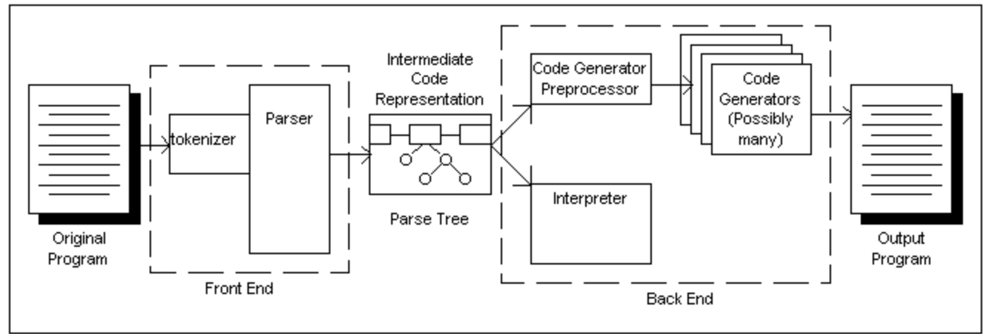

# Compiler Basics

Paper by: © James Alan Farrell, August 1995 [link](http://www.cs.man.ac.uk/~pjj/farrell/compmain.html)

Table of contents:
- [About this paper](#about-this-paper)
- [Basic Language Theory]()
- [Syntax]()
- [Semantics]()
- [Chomsky Normal Form]()
- [Extended Backus Naur Form (EBNF)]()
- [Computer Languages]()
- [Anatomy of a Compiler]()
- [The Tokenizer]()
- [Expression Parsing]()
- [Parsing Data Structures]()
- [Parsing Code Structures]()
- [Parsing Procedures and Scoping]()
- [Parsing Objects]()
- [Error Handling]()
- [Code Interpretation]()
- [Code Generation]()

<br>
<br>

---

<br>
<br>

# About this paper

- This paper is intended to give an overview of basic compiler theory. It is not intended to be complete by any means. It certainly will not replace a college level compiler course, however, it will provide a good solid foundation on which such a course can build.

- This paper does not develop a full compiler, but small examples are given in many places. Where possible, examples are given in Pascal; that is the code being parsed is Pascal and the code performing the parsing is also Pascal. This language is simple and elegant. Where C is more powerful, Pascal is more readable

- Object Oriented Programming is not covered in detail, however there is a section given on parsing objects. It seems that C++ has become the standard object oriented language, but because of its heritage it is a convoluted language that is difficult to understand. So instead of using C++ for the examples the language Language for Object Oriented Programming (LOOP) will be used. This is a language I am working on, that is intended to be a beginners' object oriented language.

<br>
<br>

---

<br>
<br>

# Basic Language Theory

- A compiler is a program that translates one language to another. The target language, that is the output of the compiler, is often assembler language or object code, but this is not necessarily the case. Many compilers convert one high level language to another high level language. One notable example of this is cfront, the UNIX C++ compiler, which translates C++ into C. The C language output is then fed into cc, the standard UNIX C compiler, which produces object code.

- In order to write a program that performs a translation on a language, that language must first be precisely and accurately defined. By precisely, we mean ALL aspects of the language must be set out. By accurately we mean that the language must be defined consistently to the smallest detail

  In order to create a language that meets these criteria, we must develop the concept of language in a formal mathematical sense. There are two parts to creating a language in the mathematical sense. The first part is defining rules for the language. This is called syntax. The second part is defining the meaning behind the rules. This is called semantics.
  
<br>
<br>

---

<Br>
<br>
  
# Syntax

- In order to define the syntax for a language we start with an alphabet. An alphabet is a series of tokens, not necessarily letters, that can be used to create strings in the alphabet. A string is a series of tokens pieced together according to the rules of the language. Strings are also sometimes referred to as sentences. So in order to define the syntax for a language, we need an alphabet and a set of rules used to manipulate the alphabet.

  The rules and the alphabet can be expressed together in one of two forms: Chomsky Normal Form (CNF) or Extended Backus Naur Form (EBNF) A description of the syntax of a language in either of these forms is called a grammar.
  
- Namely that what we normally understand as the alphabet is not what we define above as being the alphabet. According to our mathematical definition of a language, the words of the English language are the alphabet of the English language. 

  The alphabet is sometimes referred to as the lexical elements of a language. The following sentence is an example of an English language sentence:
  ```
  The cat sat.
  ```
  In this example there are three tokens, or members of the alphabet: `The`, `cat` and `sat`.
  
<br>
<br>

---

<br>
<br>

# Semantics

- Semantics refers to the meaning behind a sentence in a language. Developing mathematical rules to describe semantics has proven to be an elusive undertaking. It is possible to define a meaning for each token in an alphabet, but when tokens are placed together there are subtle interactions in meaning that make precise semantic definition of a language quite difficult. This is a major reason for continued difficulties in making modern languages completely portable.

  Solutions for describing the semantics of a language tend to be exponential, since interactions between a modifier and the object of the modifier have to be described.  Assignment statements and for loops exist in some form in most languages. But not every compiler just works for computer lang-to-computer lang. There are compilers which just translate human language to computer code (NLP) thats where you meet the harsh wilderness of compiler semantics design.
  
<br>
<br>

---

<Br>
<br>
  
# Chomsky Normal Form

- Language theory owes a great deal to Noam Chomsky. In the 1950s Chomsky studied many spoken languages and attempted to develop a formal method of describing language. 

  Chomsky Normal Form (CNF) uses a series of intermediate tokens to describe syntax rules. The left side of an expression in CNF shows a string with intermediate symbols, the right side shows how that string can be translated. The translation may contain terminal symbols, which are the tokens in the language's alphabet, or it may contain intermediate symbols, or it may contain a combination of the two. Traditionally terminals are shown with lower case letters and intermediate symbols are shown in upper case. A CNF grammar always starts with the intermediate symbol S.
  
  Lets see a usage of it:
  ```
  S -> aBa
  B -> bb
  ```
  This example again shows a grammar that can only accept a single sentence. S is replaced by aBa, and `B` is replaced by `bb`, giving the sentence `abba`.
  
  The only way CNF can be used to define a grammar that can create sentences of arbitrary length is to allow a symbol to appear in its own expansion rules.
  ```
  S -> aBa
  B -> bb | aaB
  ```
  Such a language is call recursive. Some sentences that can be generated with this grammar include abba, aaabba, aaaaabba, etc. The number of a's before the final bba is quite arbitrary.
  
- For a more complex example of CNF, we can look at the more or less standard definition of expression used by most computer languages.
  ```
  S -> EXPRESSION
  EXPRESSION -> TERM | TERM + EXPRESSION | TERM - EXPRESSION
  TERM -> FACTOR | FACTOR * EXPRESSION | FACTOR / EXPRESSION
  FACTOR -> NUMBER | ( EXPRESSION )
  NUMBER -> 1 | 2 | 3 | 4 | 5 | 6 | 7 | 8 | 9 | 0 | 
            1 NUMBER | 2 NUMBER | 3 NUMBER | 4 NUMBER |
            5 NUMBER | 6 NUMBER | 7 NUMBER | 8 NUMBER |
            9 NUMBER | 0 NUMBER 
  ```
  This is a simple but a failry complex way of showing expressions with CNF form. You dont need to understand it fully at the moment. It is peaked (referenced) here for a simple look up since it is relevant.
  
<Br>
<br>
  
---

<br>
<br>

# Extended Backus Naur Form

- A short time after Chomsky devised CNF, two researchers, Backus and Naur, independently developed a similar form for specifying language grammar. The Backus Naur form can specify some languages more compactly than CNF. Over the years other researchers have added symbols to Backus Naur Form, creating Extended Backus Naur Form (EBNF). Grammars specified in either CNF or EBNF can be converted directly into a compiler, however most compiler writers prefer to work with EBNF.

  EBNF uses the symbol :== to specify the right and left sides of a rule. Terminal symbols are placed in single quotes.
  ```
  S :== 'a' B 'a'
  B :== 'bb'
  ```
  The vertical bar is again used to represent a choice in expansion rules and just as in CNF, recursion is used to develop strings of arbitrary length. Two symbols added to EBNF that do not exist in CNF are the square brackets ([]) and curly braces ({}). The square brackets are used to denote zero or one occurrence of an expansion, and curly braces are used to denote an arbitrary, but at least one, number of expansions.
  ```
  S :== 'a' [B]
  B :== {'a'}
  ```
  
- The same concerns we had to consider with CNF follow for EBNF. A left recursive language is a left recursive language, no matter what grammar is used to specify it, and left recursive languages cannot be parsed by mechanical means. We must also worry about operator precedence no matter what grammar we use.

  Even though EBNF is rather more confusing than CNF, we will tend to use it over CNF. First of all EBNF supports loops, so we can avoid some recursion, allowing for more efficient compilers. Also EBNF is more standard for compiler writers than CNF. When we look at translating EBNF into a parser it will become easier to understand how EBNF works.
  
<br>
<br>

---

<br>
<br>

# Computer Languages

- Computer languages are languages in the mathematical sense. They are made from tokens and they can be described with right recursive grammars using either EBNF or CNF. 

  In addition to the alphabet, when reading a computer program we have to worry about delimiters. A delimiter separates two tokens. In most cases a blank space is a delimiter. Reserved symbols also act as delimiters. Any time a token is encountered that is not part of the language's alphabet, we have encountered a lexical error. This is different from a syntax error.
  
  One final aspect of computer languages is that they must be computable. The definition of computable in this case is that the language can be interpreted by a Turing machine. In order to interpret the language the Turing machine might translate it first to another language, but then the Turing machine must be able to translate it.
  
<Br>
<Br>
  
 ---
 
 <bR>
 <Br>
   
 # Anatomy of a Compiler
 
 - A compiler is a tool that translates a program from one language to another language. An interpreter is a tool that takes a program and executes it. In the first case the program often comes from a file on disk and in the second the program is sometimes stored in a RAM buffer, so that changes can be made quickly and easily through an integrated editor. We will refer to the source of the program, whether it is on disk or in RAM, as the `input stream`.
 
	Regardless of where the program comes from it must first pass through a `Tokenizer`, or as it is sometimes called, a `Lexer`. The tokenizer is responsible for dividing the input stream into individual tokens, identifying the token type, and passing tokens one at a time to the next stage of the compiler.
  
	The next stage of the compiler is called the `Parser`. This part of the compiler has an understanding of the language's grammar. It is responsible for identifying syntax errors and for translating an error free program into internal data structures that can be interpreted or written out in another language.
  
	The data structure is called a `Parse Tree`, or sometimes an `Intermediate Code Representation`. The parse tree is a language independent structure, which gives a great deal of flexibility to the code generator. The lexer and parser together are often referred to as the compiler's front end. The rest of the compiler is called the back end. Due to the language independent nature of the parse tree, it is easy, once the front end is in place, to replace the back end with a code generator for a different high level language
  
 	The next step in the process is to send the parse tree to either an interpreter, where it is executed, or to a code generator preprocessor. Not all compilers have a code generator preprocessor. The preprocessor has two jobs. The first is to break any expressions into their simplest components. For example, the assignment _a := 1 + 2 * 3_ would be broken into temp _:= 2 * 3; a := 1 + temp;_ Such expressions are called `Binary Expressions`. Such expressions are necessary for generating assembler language code. Compilers that translate from one high level language to another often do not contain this step. Another task of the code generator preprocessor is to perform certain machine independent optimizations.

 	After preprocessing, the parse tree is sent to the `code generato`r, which creates a new file in the target language. Sometimes the newly created file is then `post processed` to add machine dependent optimizations.
  
- Here is the visual representation:
  
